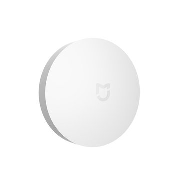
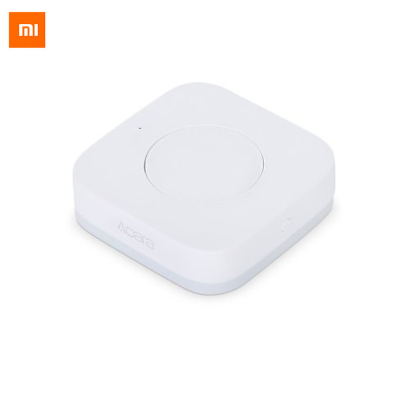
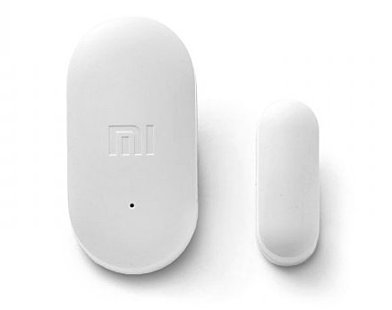
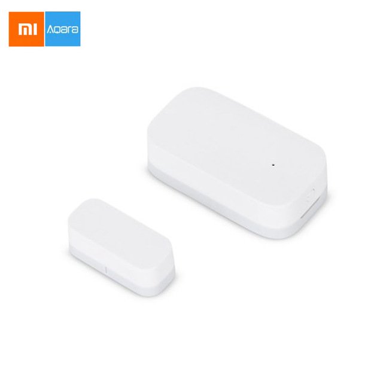
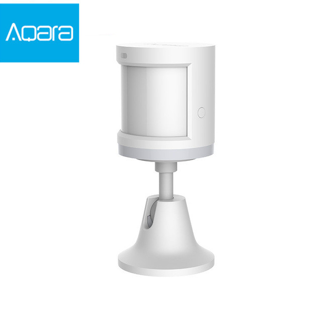
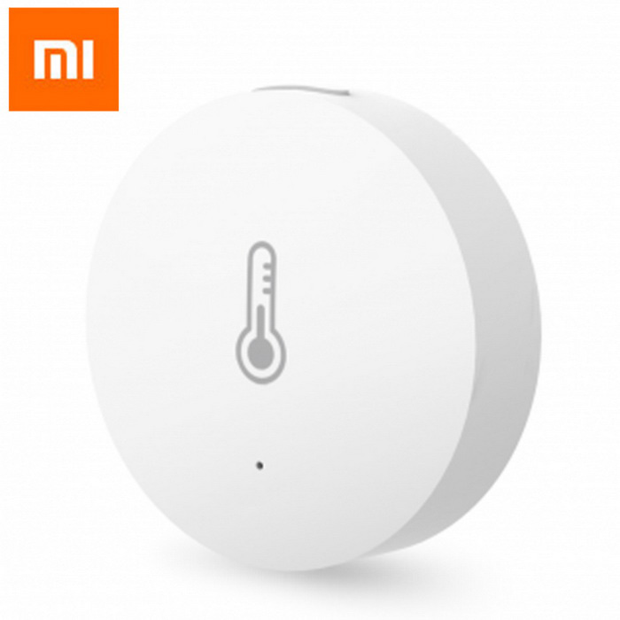
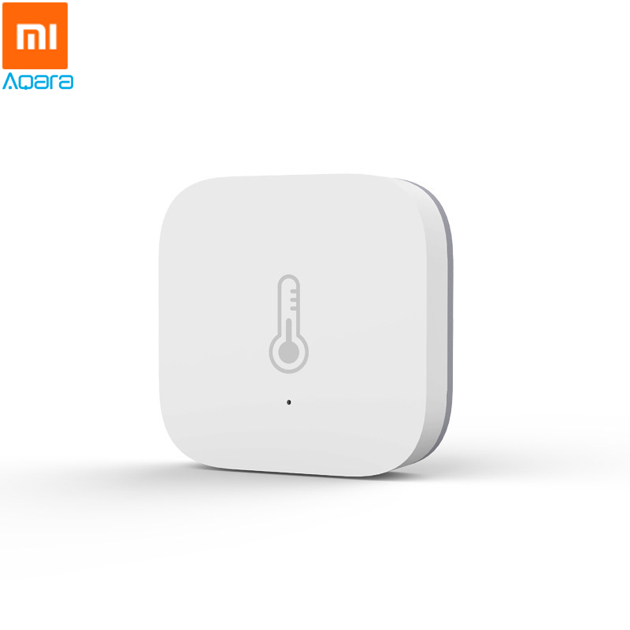
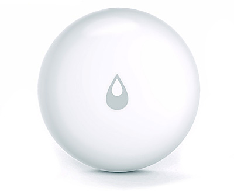
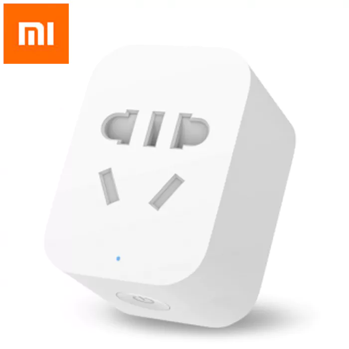

# Xiaomi Original & Aqara Device Handlers for SmartThings

Maintained by bspranger
Forked from a4refillpad's Xiaomi repository. Contributions from veeceeoh, ronvandegraaf, tmleafs & gn0st1c.

Install manually or using GitHub integration with these settings:
```
Owner: bspranger
Name: Xiaomi
Branch: master
```

---

## Pairing

These devices are not easy to pair initially. More information and help is available at <a href="https://community.smartthings.com/t/original-aqara-xiaomi-zigbee-sensors-contact-temp-motion-button-outlet-leak-etc/113253/1">this SmartThings Community Post</a>.


## Supported Xiaomi Devices

|||
|---|---|
|||
|**Xiaomi Button**|**Xiaomi Aqara Button**|
|||
|**Xiaomi Door/Window Sensor**|**Xiaomi Aqara Door/Window Sensor**|
|||
|**Xiaomi Motion Sensor**|**Xiaomi Aqara Motion Sensor**|
|||
|**Xiaomi Temperature Humidity Sensor**|**Xiaomi Aqara Temperature Humidity Sensor**|
|||
||**Xiaomi Aqara Leak Sensor**|
|||
|**Xiaomi Zigbee Outlet**||

**We do not recommend the Xiaomi Zigbee outlet as they may make SmartThings less stable.**
